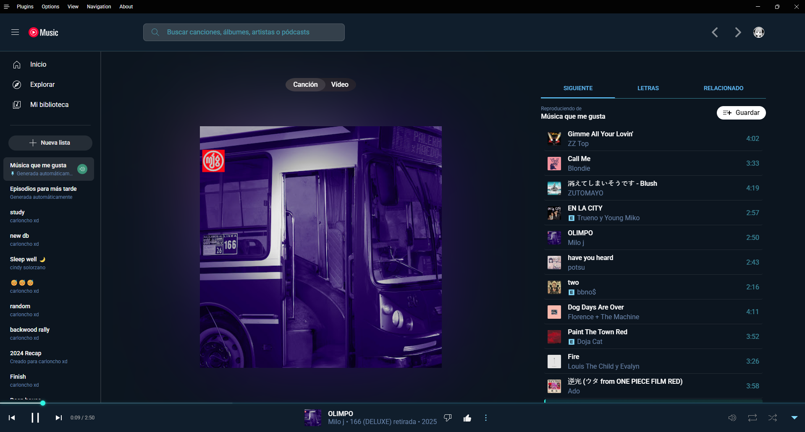

# Aurora Boreal Theme for YouTube Music

A custom CSS theme for YouTube Music inspired by the Northern Lights.

## Preview

## Features

- Deep blue and turquoise color scheme
- Aurora-like visual effects
- Enhanced interface elements
- Immersive visual experience

## Installation

1. Install a custom CSS manager extension (like Stylus for [Chrome](https://chrome.google.com/webstore/detail/stylus/clngdbkpkpeebahjckkjfobafhncgmne) or [Firefox](https://addons.mozilla.org/en-US/firefox/addon/styl-us/))
2. Create a new style for `music.youtube.com`
3. Copy and paste the content from `aurora-boreal-theme.css`
4. Save and enable the style

## Customization

You can customize colors by editing the CSS variables at the top of the file.
